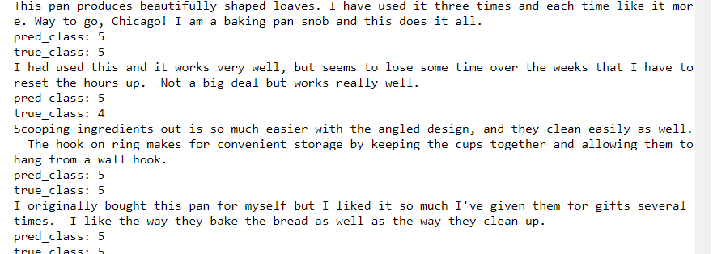

# NLP – Product Rating

## Objective:  
The objective of this repository is to create prediction on product ratings based on a text given from customer feedback.  This repository will be creating a model to predict the rating of product 1-5 stars with 5 being the highest.  

## How it works:
To create the model I will be training the model on Amazon reviews.  Amazon product reviews have a star rating system so that can be used as the target output prediction.

## Method:
There are different methods for classifying text as a rating system.  

  ### Generative (Naive Bayes): 
  Learns by the joint probability distribution p(x,y) then by using Bayes is transformed to p(y/x) however you are not directly         computing p(y/x).  In this classifier for text analysis, there is an assumption that the words are independent of one another.  

  ### Discriminative(RNN): 
  Learns the conditional probability distribution p(y/x) "probability of y given x.  This type of model would read the data sequentially to try and figure out the difference in ratings based on examples.  In this experiment I tried a number of different models (CNN, Multi Size CNN, and a LSTM).  

## Code:
The input variable in this is the text summary of a review, and the target output is the rating
* The target variable (rating) I converted this to one hot encodings
* Vectorized the text summary, I also removed emojis text
* Calculated the average, max, min of the text summary
* Set a sequence length that is appropriate 
* Tested x3 models (single hidden layer, CNN, LSTM)

## Results:
Out of the three models, I tested.  The LSTM model had an accuracy of 0.898.  It should be noted minimal fine-tuning of the model was done and the model was only trained on 10,000 of the 500,000 available rows.  

## Sample Test:

